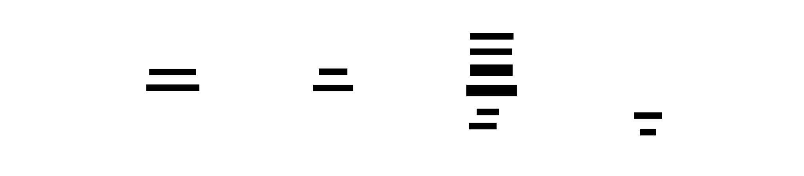
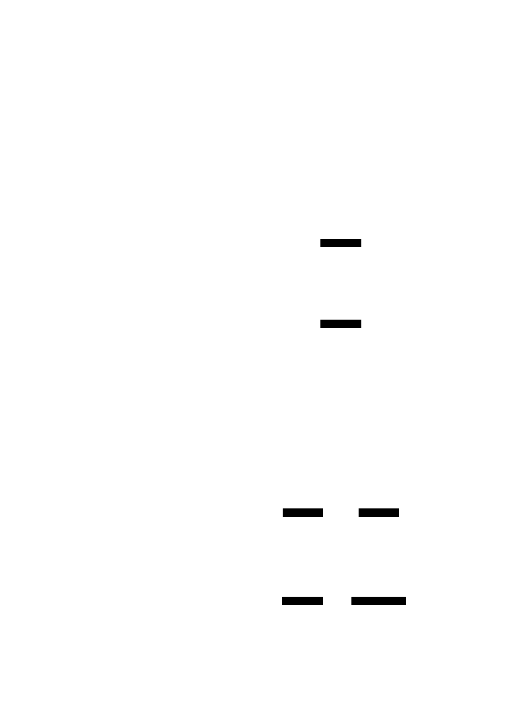

# Interactions API — high-level overview (simple, non-technical)

Diagrams are generated from D2 files in `docs/interactions_api_overview/`.

## Your Instructions (copied 1:1)

```text
read the repo and add d2 diagrams where you describe what the possilibities of the most interesting benefits of the interactions api by google.
i want to understand how input and output are processed - from a high level - simple and none technical -
i want to understand also how tool calls and input/ouput as text or other modalities can be combined.
how does it work when i have several interactions concurrently and how does it work when i stay on one interaction.
i heard that forking of interactions is possible. pls create a separate html file where you reference the diagrams that you created in d2-format
and converted to svg using d2to.sh <file.d2> thats it (on path-exists).  
thats it make sure to also copy these instructions 1:1 into the file you create followed with your findings as text and diagrams. also search web if necessary
```

## What This Repo Demonstrates

This repo is a "first feel" demo: you type into a browser UI and watch a live stream of updates come back from Google's Gemini Interactions API.

- One API request creates one *interaction* (a single "turn").
- The server asks for streaming, so you see progress and partial output as it's produced.
- To keep "conversation memory" without resending everything, the demo tracks a `previous_interaction_id`.

Evidence in this repo: the Python demo keeps one `previous_interaction_id` per WebSocket connection (`web_demo/app.py`), and the Phoenix LiveView demo keeps it per LiveView session (`playground_mix/lib/interactions_playground/live.ex`).

## Benefits / "Interesting Possibilities" (High Level)

- **Live progress**: you don't wait for a single final blob --- you can show status updates and partial output as it arrives.
- **Stateful conversations**: you can continue where you left off by referencing a `previous_interaction_id` (instead of resending the whole chat history every time).
- **Actions + answers**: the same interaction can involve tool calls (do something) and then return the result or a final response.
- **Multimodal in/out**: inputs and outputs can be mixed (text plus other media) while following the same "stream of events" pattern.
- **Concurrent requests**: you can start several interactions independently; using the same `previous_interaction_id` can create multiple alternative branches from that point.

## Diagram: One Interaction (How Input Becomes Output)


*One interaction is one "turn": your input goes in, and you receive a stream of updates back.*

## Diagram: Tool Calls (How "Doing Things" Fits In)

Tool calls are how a model/agent asks your app to do actions (look something up, call an API, write to a database) during an interaction.



*The "loop" can repeat: tool call → tool result → model continues → more tools or final answer.*

## Diagram: Combining Modalities (Text + Other Media)

High-level idea: instead of "just a string", input and output can be a bundle of different types of content. The interaction still looks like "submit once, stream events back".


*The same turn can involve text plus other modalities, plus structured tool calls and results.*

## Diagram: Staying Linear vs Concurrent Branches

If you want one clean storyline, you do one interaction at a time. If you start multiple interactions from the same "previous" interaction, you create parallel paths (branches).



*Branching allows for exploring different directions, but the client must track which ID to use for the next step.*

## How To Think About "Branching" (Simple Mental Model)

Imagine each interaction is a card in a stack. If you always add the next card on top of the newest completed card, you get one straight stack (linear).

If you take the same card and start two different "next cards" at the same time, you now have two possible stacks. That's branching. Later you choose which path to continue from.

Note: the official Interactions docs focus on `previous_interaction_id` (continuing from a prior interaction). Using the same prior ID for multiple new interactions is a client-side branching pattern; the docs don’t consistently use the word “fork”.

## Official Google References

- [Interactions docs](https://ai.google.dev/gemini-api/docs/interactions)
- [Interactions API reference](https://ai.google.dev/api/interactions-api)
- [Deep Research docs](https://ai.google.dev/gemini-api/docs/deep-research)
- [Interactions OpenAPI spec](https://ai.google.dev/api/interactions.openapi.json)
- [Announcement blog post](https://blog.google/innovation-and-ai/technology/developers-tools/interactions-api/)

## Notes On Sources Used Here

- This explainer is based on (a) what this repo’s demos implement (streaming SSE events, `previous_interaction_id`, concurrency patterns) and (b) the official links above, as already summarized in `GOOGLE_INTERACTIONS_API_FINDINGS.md`.
- I re-checked key claims (state via `previous_interaction_id`, tool calls via `function_call`/`function_result`, and stream resumption via `last_event_id`) against the official `ai.google.dev` pages using Perplexity web search; where wording goes beyond what the docs explicitly say, it’s labeled as a client-side pattern.

## How Concurrency Looks In This Repo

- **Python demo (`web_demo/`)**: one message streams at a time per WebSocket.
- **Phoenix LiveView demo (`playground_mix/`)**: multiple messages can be in-flight; each gets its own task and its own stream of events.
- **Keeping order**: the LiveView demo tracks the `previous_interaction_id` to maintain a logical sequence even if events arrive out-of-order.

## Generating The SVGs

These SVGs are generated from D2. Run (from repo root):

```text
d2to.sh docs/interactions_api_overview/01_single_interaction_flow.d2
d2to.sh docs/interactions_api_overview/02_tool_calls_loop.d2
d2to.sh docs/interactions_api_overview/03_multimodal_inputs_outputs.d2
d2to.sh docs/interactions_api_overview/04_concurrency_and_forking.d2
```
